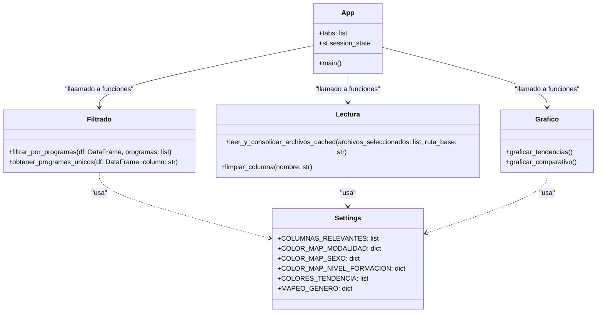

## Grupo: SNIES_proyecto3

# Descripción del Proyecto
Este proyecto es una aplicación interactiva desarrollada en Streamlit que permite procesar, analizar y visualizar datos educativos de programas académicos proporcionados por el SNIES (Sistema Nacional de Información de la Educación Superior). La aplicación automatiza las tareas de carga, filtrado, procesamiento y visualización de estadísticas relacionadas con inscripciones, matrículas, admitidos y graduados.

El proyecto consta de varios módulos que interactúan entre sí para lograr los siguientes objetivos:

- Carga y consolidación de archivos de entrada.
- Filtrado de programas académicos.
- Procesamiento de datos consolidados.
- Visualización interactiva y exportación de resultados.
- Funcionamiento General del Proyecto

## 1. Módulo de Carga de Información
#### Requerimiento: Permite procesar archivos en formato .xlsx siguiendo la convención de nombres como admitidos2021.xlsx o matriculados2022.xlsx.

### Flujo:

Los archivos deben colocarse en la carpeta inputs o cargarse directamente desde la interfaz.
El sistema lee todos los archivos relevantes basados en un rango de años definido por el usuario.
- Normalización de datos: Se asegura que las columnas necesarias estén presentes y sean consistentes mediante funciones del archivo lectura.py.
Si el usuario carga nuevos archivos a través de la interfaz, estos se almacenan temporalmente para su análisis.

- *lectura.py:* Contiene funciones como leer_y_consolidar_archivos_cached, que procesa y combina múltiples archivos en un solo DataFrame consolidado.

## 2. Módulo de Filtrado de Información
#### Requerimiento: Permite filtrar programas académicos en dos pasos:

- Búsqueda por palabras clave: Identifica programas académicos relevantes basados en términos ingresados por el usuario.
- Selección de programas: Presenta una lista de programas con información adicional (como institución, nivel de formación, código SNIES) y permite seleccionar aquellos que se incluirán en el análisis.
#### Flujo:

Los programas únicos se identifican a partir de los datos consolidados.
Se utiliza un componente interactivo de Streamlit **(checkboxes)** para facilitar la selección de programas de interés.
Los datos de los programas seleccionados se filtran y almacenan para análisis posterior.

- *filtrado.py:* Implementa las funciones de filtrado, como filtrar_por_programas y obtener_programas_unicos, que extraen los programas académicos y permiten el filtrado dinámico.
- *app.py:* Incluye la lógica de interfaz para mostrar los programas y facilitar su selección.

## 3. Procesamiento de Datos
#### Requerimiento: Calcula métricas específicas para cada programa académico y año, tales como:

Estudiantes inscritos.
Estudiantes admitidos.
Estudiantes matriculados por primera vez.
Total de estudiantes matriculados.
Estudiantes graduados.
#### Flujo:

Después del filtrado, el sistema agrupa los datos por programa académico y año.
Los datos se procesan para sumar las métricas seleccionadas.
Los resultados procesados se preparan para exportación en formatos como .xlsx, .json y .csv.

- *lectura.py:* Normaliza columnas y verifica que los datos cumplan los estándares requeridos.
- *settings.py:* Contiene las constantes necesarias para identificar columnas relevantes.
- *app.py:* Controla el flujo de procesamiento y generación de resultados exportables.

## 4. Visualización de Información
#### Requerimiento: Proporciona gráficos interactivos para analizar tendencias y realizar comparaciones entre categorías.
- Visualizaciones Principales:
Gráficos de líneas y barras de tendencias históricas:

Muestra estadísticas como inscripciones, admisiones y graduaciones a lo largo de los años.
Permite seleccionar programas específicos y métricas para personalizar el análisis.
Gráficos comparativos:

Comparan estadísticas por:
Modalidad de estudio (Presencial/Virtual).
Género (Masculino/Femenino).
Nivel de formación (Pregrado, Maestría, etc.).
Ofrecen opciones de barras agrupadas o apiladas.
#### Flujo:

Los gráficos se generan utilizando Plotly, con datos consolidados filtrados.
Los usuarios pueden interactuar con los gráficos (zoom, filtrar categorías, etc.) para explorar los datos.

- *grafico.py:* Contiene funciones como graficar_tendencias y graficar_comparativo, que generan gráficos interactivos a partir de los datos procesados.
- *app.py:* Integra los gráficos en la interfaz de usuario.

## 5. Exportación de Resultados
#### Requerimiento: Permite a los usuarios descargar los datos procesados en tres formatos:

- **Excel (.xlsx):** Utiliza openpyxl para generar archivos Excel listos para análisis.
- **JSON:** Exporta los datos en formato estructurado JSON.
- **CSV:** Genera archivos CSV para análisis en herramientas externas.
#### Flujo:

Los datos agrupados y procesados se almacenan en un buffer temporal.
Los usuarios descargan los archivos directamente desde la interfaz.

- *app.py:* Implementa la lógica de exportación y muestra los botones de descarga.
- *settings.py:* Define configuraciones adicionales para exportar datos.

### *Principales Tecnologías y Librerías que se usaron:*
- Streamlit: Para crear la interfaz interactiva.
- Pandas: Para la manipulación y procesamiento de datos.
- Plotly: Para generar gráficos interactivos.
- OpenPyXL: Para la exportación de datos en formato Excel.

## Principios Aplicados
- **Modularidad:** Cada funcionalidad clave está implementada en un módulo independiente (lectura.py, filtrado.py, etc.).
- **GRASP Principles:** Baja dependencia entre módulos, con clases y funciones enfocadas en tareas específicas.
- **Manejo de Errores:**
Manejo robusto de excepciones al leer archivos y procesar datos.
Validación de entradas del usuario, como rangos de años o nombres de columnas.

